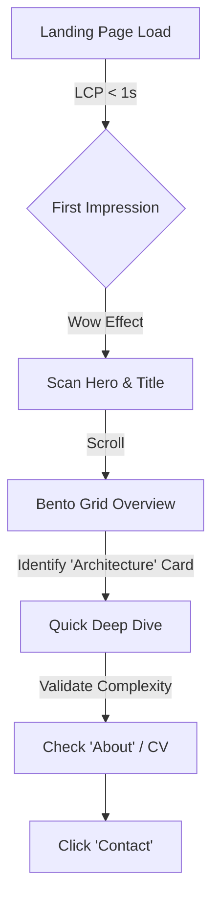
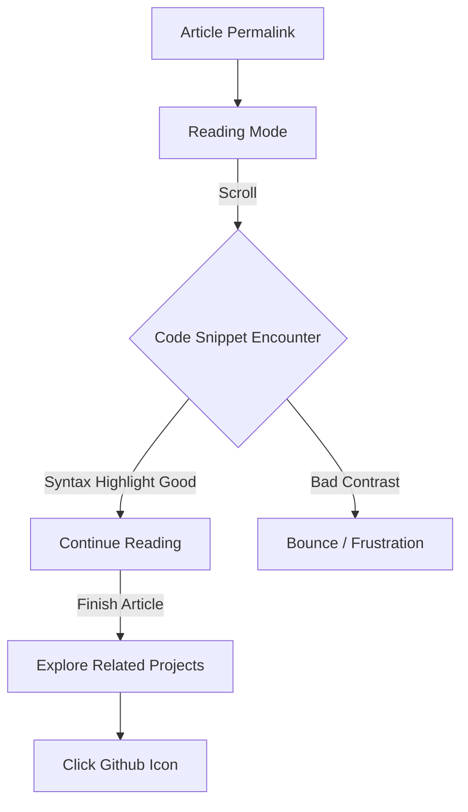
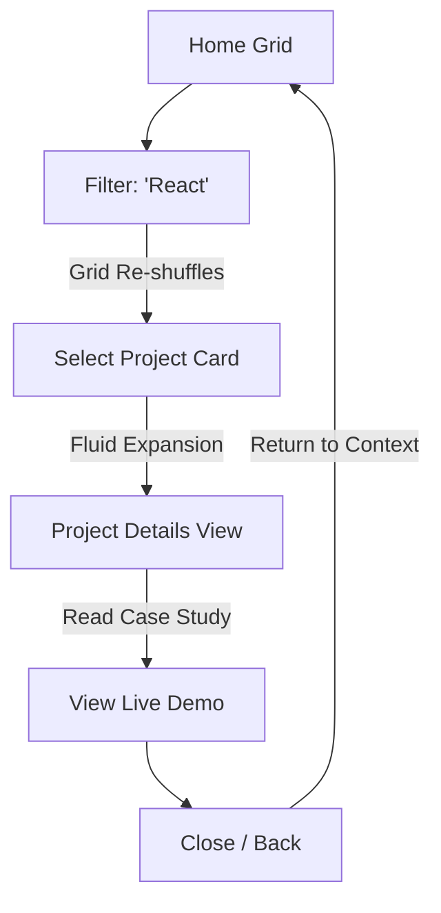

# UX Design Specification: Nicolas Dabène - Nexus Design 2026

**Author:** BMad Agent (Collaborating with Nicolas Dabène)
**Date:** 2026-01-30

---

## 1. Design Context & Vision

### Vision
To transform the current `nicolas-dabene.fr` interface into a **premium, immersive, and living** digital experience that reflects the technical authority of Nicolas Dabène. The "Nexus" system merges high-end aesthetics (Glassmorphism, Bento design, "Deep Slate & Gold" palette) with modern, modular software architecture.

### Core Design Pillars (Nexus System)
1.  **Immersive Depth:** Heavy use of Glassmorphism (blur, transparency, borders) to create hierarchy and depth.
2.  **Living Interface:** Micro-interactions, smooth parallax, and "living" backgrounds (bubbles, glows) that respond to user presence.
3.  **Premium Aesthetics:** A "Deep Slate & Gold" color palette enforcing a feeling of luxury, precision, and technical mastery.
4.  **Bento Grid Layouts:** Structured, modular content presentation for scanning efficiency and visual clarity.

### Technical Foundation (Existing Assets)
The design will leverage and expand upon the existing SCSS foundation:
*   **Tokens:** `_sass/nexus/_tokens.scss` (Colors, Glass variables)
*   **Components:** `_sass/nexus/_glass.scss`, `_sass/nexus/_hero-nexus.scss`
*   **Animations:** `_sass/nexus/_animations.scss` (Pulse, Glow)

---

## 2. Project Understanding & Context

### Project Vision
The 2026 redesign of `nicolas-dabene.fr` aims to be a "Portfolio 2.0" – a direct demonstration of technical mastery through a **premium, immersive, and living** interface. It serves as a proof-of-concept for the "Nexus System," merging high-end aesthetics with robust engineering.

### Target Users
*   **Marc (Strategic CTO):** Needs immediate visual confirmation of expertise. Values polish, finish, and complexity handling.
*   **Sophie (Senior Developer):** Needs technical validation. Values clean architecture, performance, and readability (Dark Mode).

### Key Design Challenges
1.  **Performance vs. Immersion:** Balancing heavy visual effects (Glassmorphism, Blur, Parallax) with strict performance metrics (Lighthouse > 90).
2.  **Content Scannability:** Presenting dense technical content (Blog) in a way that is both visually engaging (Bento) and easy to consume.
3.  **"Living" Feel:** Ensuring the interface feels alive (micro-interactions) without becoming distracting or overwhelming.

### Design Opportunities
*   **Sticky Glass Navigation:** A navigation bar that creates depth by blurring content underneath, acting as a visual anchor.
*   **Interactive Bento Grid:** Modular content cards with "Gold Glow" hover effects to guide user attention and encourage exploration.
*   **Narrative Hero:** A Hero section that uses parallax and depth to visually represent the concept of "Orchestration" and "Architecture."

## 3. Core User Experience

### Defining Experience
The core experience describes **"Scanning Authority."** Users (recruiters, peers) visit to validate expertise. The interface acts as the first technical interview: if the site is performant, polished, and structured, the engineer is perceived as competent. The goal is to convey senior-level expertise in <10 seconds.

### Platform Strategy
*   **Primary Context:** Desktop Web (Recruiters/CTOs reviewing portfolios at work) & Mobile (Quick checks via social links).
*   **Responsiveness:**
    *   **Desktop:** Maximized for immersion (Parallax, hover effects, multi-column Bento).
    *   **Mobile:** Maximized for speed and ergonomics (Thumb-friendly navigation, simplified animations).

### Effortless Interactions
1.  **Instant Filtering:** Blog categories change instantly without page reloads, using fluid layout transitions.
2.  **Smart Navigation:** The sticky glass header/footer reveals controls only when needed, maintaining focus on content.
3.  **Visual Feedback:** Every interactive element (card, button) gives immediate, subtle feedback (glow/lift) on hover/touch.

### Critical Success Moments
1.  **The First Load:** The Hero section must load instantly (<1s LCP) while delivering the "Wow" factor of the Nexus visual style.
2.  **Code Readability:** When a developer opens a blog post, syntax highlighting and typography must be perfect (contrast, spacing).
3.  **Discovery Loop:** The user naturally flows from the Hero -> Bento Grid -> Specific Case Study without friction.

### Experience Principles
1.  **Authority through Polish:** "If the pixels are perfect, the backend is robust."
2.  **Depth over Clutter:** Use Glassmorphism (blur, layers) to organize information depth without visual noise.
3.  **Performance is Beauty:** Visual richness must never compromise the 60fps interaction standard.
4.  **Living Interface:** The UI breathes and reacts (micro-interactions) to create a human connection with technical content.

## 4. Desired Emotional Response

### Primary Emotional Goal: "Technical Reverence"
The user should feel a mix of aesthetic admiration and technical respect. The design says "I master my craft." It moves beyond "beautiful" to "engineered perfection."

### Emotional Journey Mapping
1.  **Discovery (Hero):** **Awe.** "This is premium." (Triggered by: Parallax depth, cinematic lighting).
2.  **Exploration (Grid):** **Flow.** "It just works." (Triggered by: Instant filters, smooth scroll, responsive cards).
3.  **Consumption (Article):** **Focus.** "I can read this for hours." (Triggered by: Deep Slate background, perfect typography, syntax highlighting).
4.  **Decision (Contact):** **Confidence.** "This is the expert I need." (Triggered by: Clean forms, clear CTAs).

### Micro-Emotions
*   **Delight** (via Micro-interactions): Subtle golden glows that follow the cursor create a sense of magic without being intrusive.
*   **Calm** (via Color Palette): The "Deep Slate" (#020617) reduces eye strain, creating a calming environment for technical reading.
*   **Trust** (via Performance): Instant page loads signal reliability.

### Design Implications for Emotion
*   **To evoke Respect:** Enforce pixel-perfect alignment in Bento Grids. No "floaty" or approximate layouts.
*   **To evoke Curiosity:** unexpected but logical transitions (e.g., categories morphing instead of simple fading).
*   **To evoke Trust:** Feedback for every action. A click is never ambiguous.

### Emotional Design Principles
*   **Serious, not Somber:** It's dark mode, but the Gold accents make it warm and inviting, not depressing.
*   **Complex, not Complicated:** Show technical depth (layers, blur) without cognitive overload.
*   **Show, Don't Just Tell:** Let the performance of the site prove the technical skills mentioned in the CV.

## 5. UX Pattern Analysis & Inspiration

### Inspiring Products Analysis
1.  **Linear / Raycast:** The benchmark for "Developer Premium" interfaces. They master the dark mode aesthetic with subtle borders, purposeful glows, and keyboard-centric navigation.
2.  **Vercel:** The standard for "Technical Minimalism." Usage of Bento grids to organize complex features into digestible cards.
3.  **macOS:** The reference for functional Glassmorphism. Using blur not just for style, but to establish depth and hierarchy (foreground vs background).
4.  **Medium / Substack (Mobile):** The gold standard for mobile reading readability. Focus on typography, line-height, and minimized UI during reading.

### Transferable UX Patterns
*   **Navigation:** **Sticky Glass Header.** Like macOS, the navigation blurs the content underneath, maintaining context while offering controls.
*   **Interaction:** **Cursor Glow.** Design cards where borders or backgrounds subtly light up based on cursor position (Linear style), inviting interaction.
*   **Structure:** **Bento Grid.** Breaking down the Blog and Projects into a modular grid allows for flexible content hierarchy.
*   **Reading Experience:** **Focus Mode.** On blog posts, especially mobile, UI elements recede. Typography (Inter/Poppins) scales perfectly for readability (16px+ base on mobile).

### Anti-Patterns to Avoid
*   **Scroll-Jacking:** Never hijack the native scroll behavior. Developers hate losing control of the viewport.
*   **Mystery Meat Navigation:** Avoid icon-only buttons without tooltips or clear labels. Clarity > Minimalism.
*   **Contrast Failure:** "Deep Slate" is sleek, but text must satisfy WCAG AA contrast ratios to remain legible.
*   **Mobile Neglect:** Complex hover effects that break on touch. All "hover" info must be accessible via tap or visible by default on mobile.

### Design Inspiration Strategy
*   **Adopt:** The "Engineer-First" aesthetic (Monospace fonts for code, high information density) & The "Reader-First" typography for blog posts.
*   **Adapt:** The "Apple-style" blur effects, optimized for the web (CSS `backdrop-filter`) to ensure 60fps scrolling on mobile devices.
*   **Avoid:** Over-animating entrance effects. Content should be there when the user looks for it, not 0.5s later.

## 6. Design System Foundation

### 6.1 Design System Choice: "Nexus System" (Custom Bespoke SCSS)
We are building a proprietary design system named **Nexus**. It is a lightweight, modular SCSS architecture designed specifically for high-performance Glassmorphism.
**Migration Note:** The implementation will start with a **clean slate**. We will ask the Architect to preserve functional logic (Jekyll/Liquid) but purge existing legacy styles before applying the new Nexus system.

### Rationale for Selection
1.  **Performance Control:** Stasis hosting on Github Pages requires minimal JS bloat. A zero-runtime CSS system is optimal for achieving Lighthouse > 90.
2.  **Visual Uniqueness:** The specific "Deep Slate & Gold" and complex multi-layer Glassmorphism effects are difficult to replicate cleanly with ready-made component libraries (MUI/Bootstrap).
3.  **Architectural Proof:** Building a custom, maintainable design system is, in itself, a demonstration of the engineering skills the portfolio aims to showcase.
4.  **Clean Codebase:** Starting fresh on styles eliminates technical debt and ensures every line of CSS serves the new vision.

### Implementation Approach
*   **ITCSS Architecture:** Organizing SCSS from generic (Tokens) to specific (Components).
*   **Design Tokens:** Single source of truth for Colors, Spacing, Blur levels, and Typography using CSS Variables for runtime dynamic theming if needed.
*   **Utility Mixins:** Powerful SCSS mixins to apply standardized "Glass" effects ensuring consistency across all components.

### Customization Strategy
*   **Fluid Typography:** Use of `clamp()` functions in tokens to ensure perfect scaling from Mobile to Ultra-Wide monitors without dozens of breakpoints.
*   **Mobile Optimisation:** Complex hover effects (Glows) will degrade gracefully to static visible states on touch devices to ensure usability.

## 7. Defining Core Experience Mechanics

### 7.1 Defining Interaction: "The Fluid Deep Dive"
The signature interaction is the seamless transition from the high-level Bento Grid to detailed content. It must feel like expanding a layer of reality, not loading a new web page.

### 7.2 User Mental Model
*   **Layers of Depth:** Users perceive the portfolio as a 3D space. The "Hero" is the top layer. "Projects" are windows into deeper layers.
*   **Object Permanence:** When opening a project, the user expects the "Grid" to stay behind it, ready to be returned to instantly.

### 7.3 Success Criteria
*   **No Layout Shift:** Transitions must be buttery smooth (60fps).
*   **Instant Context:** The user never wonders "Where am I?". The transition explains the hierarchy.
*   **One-Handed Navigation (Mobile):** Deep Dives must be closable with a simple thumb-reachable action.

### 7.4 Experience Mechanics
1.  **Initiation (Hover/Touch):**
    *   *Desktop:* Cursor-following glow reveals active borders.
    *   *Mobile:* Card scales down slightly on touch (`:active`) to mimic physical tactile feedback.
2.  **Transition (Expansion):**
    *   The clicked card becomes the focal point. Other elements blur out or recede.
    *   Using **View Transitions API** (if supported) or carefully orchestrated CSS animations to morph the card into the header of the next page.
3.  **Return (Closure):**
    *   The "Back" action reverses the exact animation, reinforcing the sense of place.

## 8. Visual Design Foundation

### 8.1 Color System: "Deep Slate & Gold"
*   **Backgrounds:**
    *   `$bg-depth`: #020617 (Deep Slate) - The canvas.
    *   `$bg-glass`: rgba(255, 255, 255, 0.05) - The layer material.
*   **Accents:**
    *   `$gold-primary`: #FFD700 (Icons, Borders, Glows).
    *   `$gold-text`: #FFE55C (High-contrast variant for text).
    *   `$tech-blue`: #3B82F6 (Links, Technical focus).

### 8.2 Typography System: "Engineer Editorial"
*   **Headings:** **Poppins** (Weights: 600, 700, 900). Geometric and assertive. Used for "Statement" text.
*   **Body:** **Inter** (Weights: 400, 500). Optimized for UI legibility at small sizes.
*   **Monospace:** **JetBrains Mono**. Used for code snippets, tags, and "data" elements to reinforce the engineering identity.

### 8.3 Spacing & Layout Foundation
*   **Grid System:** 12-column fluid grid.
    *   *Gutter:* 24px (Desktop) / 16px (Mobile).
*   **Spatial Principle:** "Airy Glass". Glassmorphism requires larger paddings (min 24px) to allow the background blur to be perceptible.
*   **Reading width:** Strictly limited to 65ch (approx 700px) for blog articles to prevent eye fatigue.

### 8.4 Accessibility Considerations
*   **Contrast enforcement:** Text covering the glass layers must maintain a 4.5:1 ratio against the dark background.
*   **Motion Reduction:** Respect `prefers-reduced-motion`. Parallax and smooth scrolling will be disabled via CSS media query for users who request it.

## 9. Design Design Decision

### 9.1 Explored Directions
1.  **Deep Immersion:** Heavy Glassmorphism, 3D parallax background. High visual impact but potential performance risks.
2.  **Technical Zenith:** Wireframe/Terminal aesthetic. Extremely performant but lacks the "Premium" feel needed for a Senior Architect profile.
3.  **Balanced Nexus (Chosen):** A hybrid approach. Deep dark backgrounds with strategic Glassmorphism usage only on interactive layers (Nav, Cards).

### 9.2 Chosen Direction: "Balanced Nexus"
We select the **Balanced Nexus** direction. It prioritizes content legibility while using "Nexus" visual tokens (Gold Borders, Glows, blurred overlays) as enhancers, not distractors.

### 9.3 Design Rationale
*   **Performance:** Avoiding full-screen blurs keeps repaints low.
*   **Legibility:** Content always sits on high-contrast backgrounds (Deep Slate), not on noisy transparent layers.
*   **Scalability:** Easier to maintain CSS gradients than complex 3D assets.

### 9.4 Implementation Approach
*   **Backgrounds:** CSS Radial Gradients for the "Glow" spots behind the glass.
*   **Borders:** 1px solid borders with `rgba` colors to create the "cut glass" look.
*   **Shadows:** Multi-layered colored shadows (Blue/Gold) instead of standard black drop-shadows to create "Neon" depth.

## 10. User Journey Flows

### 10.1 Journey 1: The Hiring Scan (Speed & Authority)
**User:** Marc (CTO)
**Goal:** Confirm seniority in < 30 seconds.

### 10.2 Journey 2: The Tech Validation (Depth & Clarity)
**User:** Sophie (Senior Dev)
**Goal:** Validate coding standards and technical depth.

### 10.3 Journey 3: The Discovery Loop (Exploration)
**User:** Peer / Recruiter
**Goal:** Explore the breadth of skills via the Bento Grid.

### Journey Patterns
*   **The "Peek & Pop" Pattern:** Users can preview technical depth (hover/glance) before committing to a click.
*   **Contextual Return:** The "Back" action always restores the exact scroll position and filter state of the Grid.

## 11. Component Strategy

### 11.1 Core Components (Nexus System)

#### `c-glass-card` (The Fundamental Unit)
**Purpose:** Universal container for content (Projects, Articles, About).
**Anatomy:**
*   Layer 1: Glass Background (`rgba(255,255,255,0.03)` + Blur).
*   Layer 2: Content (High contrast text).
*   Layer 3: Hover Overlay (Radial Gradient Glow).
*   Layer 4: Border (1px transparent -> Gold on hover).
**States:** Default, Hover, Focused, Expanded (Active).

#### `c-nav-dock` (Navigation)
**Purpose:** Persistent navigation anchor.
**Behavior:** Floating dock pattern (like macOS/iOS) rather than full-width bar. Centers content and detaches from edges to feel "floating".

#### `c-code-block` (The Evidence)
**Purpose:** Display technical expertise with high fidelity.
**Features:**
*   **Header:** Filename + Language Badge.
*   **Actions:** "Copy to Clipboard" (Essential).
*   **Theme:** Custom specific syntax highlighting matching the "Deep Slate" palette.

### 11.2 Implementation Roadmap

**Phase 1: The Skeleton (MVP)**
1.  `c-glass-card`: To build the grid structure.
2.  `c-nav-dock`: For basic navigation.
3.  `c-hero`: For the landing introduction.

**Phase 2: The Content (Reading Experience)**
4.  `c-article-body`: Optimization of typography for long-form reading.
5.  `c-code-block`: Syntax highlighting implementation.

**Phase 3: The Magic (Polishing)**
6.  `c-project-expand`: The logic for the "Deep Dive" transition.
7.  `c-particles`: The background micro-interactions.

## 12. UX Consistency Patterns

### 12.1 Button Hierarchy
*   **Primary:** Solid `Nexus Gold` background, dark text. High focal weight. Max 1 per viewport.
*   **Secondary:** Glass background (5% white) + 1px Gold border. Used for article discovery.
*   **Tertiary:** Transparent background, gold bottom border on hover. Used for "Back to top" or minor links.

### 12.2 Feedback Patterns
*   **Interactive Glow:** Any clickable element reveals a faint radial glow following the cursor (Desktop only).
*   **Input Validation:** Real-time feedback. Borders turn Gold on valid input, or Muted Red on error. No disruptive pop-ups.
*   **Micro-interactions:** Subtle 2% scale-up on hover to signal interactivity.

### 12.3 Navigation Patterns
*   **Progressive Dock:** The main navigation starts as a full bar at the top, then shrinks into a floating centered "Dock" after 200px of scroll.
*   **Breadcrumbs:** Minimalist breadcrumbs for blog articles (e.g., `Archive / Cloud Architecture`).

### 12.4 Modal & Overlay Patterns
*   **Backdrop Blur:** All overlays (mobile menu, expanded cards) MUST use `backdrop-filter: blur(10px)` to maintain context of the underlying page.
*   **Safe-to-Dismiss:** Modals can always be closed by clicking the backdrop.

### 12.5 Filtering Patterns
*   **The Shuffle:** When filtering categories, cards "fly" to their new positions using smooth CSS transitions, reinforcing the modular nature of the Bento Grid.

## 13. Responsive Design & Accessibility

### 13.1 Responsive Strategy
*   **Mobile-First Approach:** Core reading experience optimized for single-column thumb-scrolling.
*   **Adaptive Navigation:** Fixed Bottom Tab Bar on Mobile; Floating Top Dock on Desktop.
*   **Bento Adaptation:** Grid columns transition from 1 (Mobile) to 2 (Tablet) to 4 (Desktop).

### 13.2 Breakpoint Strategy
*   **Breakpoint A (Mobile):** 320px - 767px (Full stacking).
*   **Breakpoint B (Tablet):** 768px - 1023px (Bento becomes 2x2 grid).
*   **Breakpoint C (Desktop):** 1024px - 1440px (Full 12-column grid layout).
*   **Fluid Sizing:** Global use of `clamp(1rem, 2vw, 1.5rem)` for body text to maintain visual harmony.

### 13.3 Accessibility Strategy (WCAG 2.1 Level AA)
*   **Contrast:** `Slate 50` text on `Deep Slate` backgrounds ensures high legibility.
*   **Focus Management:** High-visibility Gold focus rings for all interactive elements.
*   **Skip Links:** "Skip to Content" link hidden by default, visible on Tab focus.
*   **Inclusive Motion:** Conditional rendering of heavy animations based on user motion preferences.

### 13.4 Implementation Guidelines
*   **Semantic HTML:** Use `<article>`, `<section>`, `<nav>` correctly.
*   **Touch Targets:** Minimum size of 48x48px for all mobile buttons.
*   **Relative Units:** Use `rem`/`em` for fonts and `vh`/`vw` for decorative layers.

<!-- UX design content will be appended sequentially through collaborative workflow steps -->
